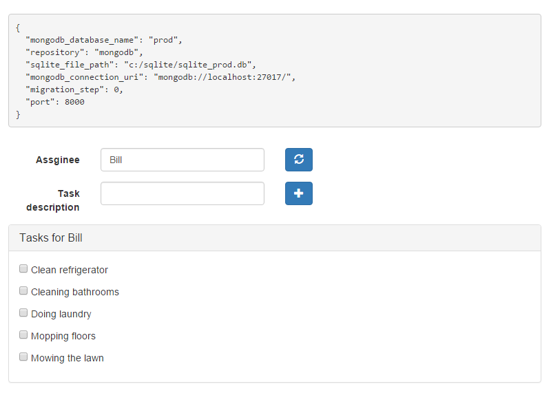
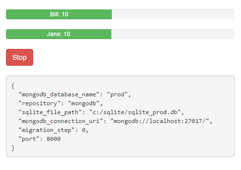

#Safe Database Migration Pattern Without Downtime

Adi Levin, December 28, 2015

#Introduction

This is a demonstration of the safe database migration pattern introduced by 
Aviran Mordo in [his blog post](http://www.aviransplace.com/2015/12/15/safe-database-migration-pattern-without-downtime/).
We start by running the application on top of [SQLite](https://www.sqlite.org/), 
and we follow Aviran Mordo's 8 steps to migrate to [MongoDB](https://www.mongodb.org/), 
without downtime.

#The 8 steps for a safe migration

For a more complete description of the pattern, please go to 
[Aviran Mordo's blog post](http://www.aviransplace.com/2015/12/15/safe-database-migration-pattern-without-downtime/).

1. Deploy new database into production
2. Add new data access object in the app to write to the new database
3. Start writing to the new database but use the old one as primary
4. Read from both databases
5. Make the new database the primary
6. Stop writing to the old database
7. Migrate data from the old database to the new one
8. Delete the old data access object

#What's included in this repository

1. Flask application, in folders *main, data_access_objects, model*, and unit tests in *test*.
2. HTML + Javascript + CSS for the user console and automatic task producer, in folder *main/static*
3. An initial NGINX configuration file in folder *nginx*
4. A script *spawn.bat* to spawn a running instance of the application at a given port

#Setup

This was only tested on Windows, but it should work on any platform, except for the spawn.bat file that is 
specific to Windows and can be be easily rewritten for Linux.

###Install dependencies

- [Install Python 2.7](https://www.python.org/downloads/)

- [Install MongoDB](https://docs.mongodb.org/manual/)

- [Install greenlet package](https://pypi.python.org/pypi/greenlet), a prerequisite for gevent
>`pip install greenlet`

- [Install gevent](http://www.gevent.org/) as the WSGI server

- [Install NGINX](http://nginx.org/en/download.html) which we use as a reverse proxy, to 
switch application versions without downtime 

###Setup databases

- Start a MongoDB instance by running
>`mongod`

- Prepare an SQLite production environment by creating a folder where the application will place the sqlite production
database
> `mkdir c:\sqlite`

###Setup Python project

- Clone the repository

- Run tests from the repository root folder
> `python -m unittest discover -s test`

###Setup reverse proxy

- Copy <repository_root>/nginx/nginx.conf to the conf subfolder in the nginx installation folder. It routes traffic from port 5000 to port 8000.
 
- Run NGINX
> start nginx

###Run application on port 8000
 
- Open a command-line in the db-migration folder

 > `set PYTHONPATH=.` (on Windows)

 > `python main/main.py 8000`

- Open a user console ([localhost:5000](http://localhost:5000)) 

- Open an automatic task producer ([localhost:5000/static/taskProducer.html](localhost:5000/static/taskProducer.html))

#The data model

A *task* has 4 attributes:

1. `id` - string (A universally unique ID, given by the application)
2. `assignee` - string
3. `description` - string
4. `done` - boolean

#The REST API

- `GET /tasks?assignee=<assignee_name>`: Get all remaining tasks for a given assignee
- `GET /tasks/<task_id>`: Get a single task
- `POST /tasks "assignee=<assignee_name>&description=<task_description>"`: Add a task.
- `PUT /tasks/<task_id>`: Mark a task as done
- `GET /config`: Get server configuration info

 
#The user console

This is a ToDo application, where users can see their remaining tasks and mark them as done, by clicking checkboxes.
For the user console, open [http://localhost:5000](http://localhost:5000) when the app is running.
The page also displays the server configuration and refreshes it every 3 seconds. The server configuration panel
will change its color when the configuration changes.

To refresh the task list, you must hit the refresh button.

#The automatic task producer

In addition, we have a web page that automatically produces tasks for two users, Bill and Jane, and marks them
 as done. For the automatic task producer, 
 open [http://localhost:5000/static/taskProducer.html](http://localhost:5000/static/taskProducer.html)
 when the app is running.
 
 The "Start"/"Stop" button can be used to start and stop task generation.
 This page also displays the same server configuration panel as the user console.

#Demonstration guidelines

For a successful demonstration, follow this step-by-step procedure:

- Go through the basics
  1. Run the application using SQLite
  1. First, introduce the application by showing the user console
  1. Invite the audience to open a user console on their notebooks and start adding tasks and marking tasks as done
  1. Show the data in an SQLite browser to prove that the data is written to SQLite
  1. Now stop the application and rerun it after configuring to use MongoDB
  1. Ask the audience to add tasks, and show the data in the mongo console
  1. Open the automatic task producer and show how this adds data in mongo.  
- Show some code
  1. Show the data access layer
  1. Show the API REST handlers
- Demonstrate reconfiguration of NGINX to switch application versions
  1. Start a new instance of the application, that uses SQLite
  1. Reconfigure NGINX to start using the new application version without downtime.
  1. Emphasize that data was lost in this process.
- Prepare for live demo of safe migration
  1. Stop the application
  1. Clear both SQLite and MongoDB production databases
  1. Configure the application to use SQLite
  1. Run the application on port 8000
  1. Ask the audience to enter new tasks
  1. Start the automatic task producer
  1. Ask the audience to continue refreshing and adding tasks or marking them as done during the demo, to see that their data is not lost.
- Discuss steps 1 and 2
- Step 3
  1. Spawn an instance of the application running step 3 of the migration. Do this by setting these values in main.py:
    > `'migration_step' : 3,`
    
    > `appConfig['repository'] = 'migrate_from_sqlite_to_mongodb'`
    
  1. Show the code for writing, and show that we first write to the old database.
  1. Show how new data is being written to MongoDB, using the mongo command-line
      > `use prod`
      
      > `db.tasks.find({'assignee':<some name>})`
  1. Show that old data does not exist in MongoDB yet
- Step 4
  1. Switch to step 4.
  1. Show the code for reading and discuss conflict resolution.
- Step 5
  1. Switch to step 5.
  1. Show the code for writing
- Step 6
  1. Switch to step 6.
  1. Show the code for writing
  1. Show that SQLite database is not growing anymore
- Step 7 - migration of old data from SQLite to MongoDB
  1. Run migration_utils.py. This invokes the function eagerly_migrate_data_from_sqlite_to_mongodb()
  1. During this operation, use mongo commandline to show that the old data is being added to MongoDB.
- Step 8
  1. Spawn an instance of the app that uses on MongoDB
 

  
      
